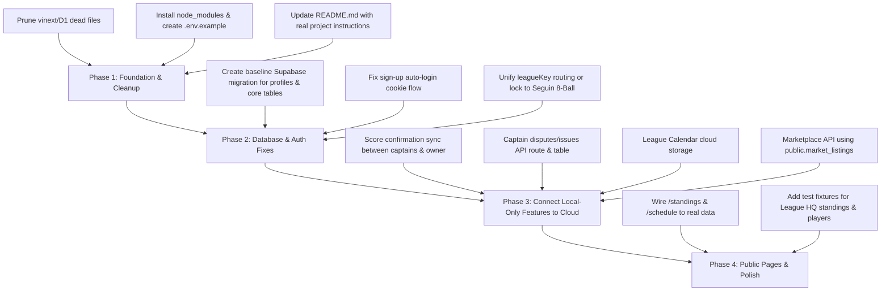

# Action Line-Up: Comprehensive Project Analysis

## 1. Executive Summary & What the Project Is

**Action Line-Up** is a full-stack web application designed for **billiard / 8-ball pool leagues and tournament operators** (tailored specifically around the real-world Seguin 8-Ball League rules and bylaws). 

The platform aims to replace clipboards, paper score sheets, and chaotic group texts on league night by offering:
- **Automatic Match Rotation & Lineup Board:** Rotates 8-player home and visitor rosters across rounds, auto-generating balanced table matchups and matchup forecast win probabilities.
- **Live Scoring & Score Sheet Review:** Game-by-game scoring with winner toggling, score sheet submission, and dual captain sign-offs.
- **Full Tournament Engine (`lib/formats.ts`, `lib/bracket.ts`, `app/tournament.tsx`):** Supports 7 tournament formats (Single Elimination, Double Elimination, Round Robin, Round Robin + Playoff, Swiss System, Chip Elimination, and Blind Draw Doubles).
- **Bar TV Kiosk (`/tv`):** A large-format live display designed for bar TVs, polling active tournament matches, table assignments, chip counts, standings, and champion banners.
- **Rule Desk & Rulebook Library:** An instant rule assistant powered by official Seguin 8-Ball League bylaws, document storage for PDF/image rulebooks, and a "Call The Hit" shot review community voting tool.
- **League HQ & Intelligence:** Standings across divisions, Action Power Rankings, player leaderboards, rivalry head-to-head analytics ("Who owns the matchup?"), and calendar scheduling.
- **Payments, Dues, and Marketplace:** Match fee tracker, captain payment links (Cash App, Venmo, PayPal, Zelle), a team fundraising progress meter, a local equipment buy/sell marketplace, and Stripe subscription tiers (Free, Basic $1.99/wk, Premium $2.99/wk).

---

## 2. Technical Stack & Architecture

- **Framework:** [Next.js 16.3.3](file:///c:/Users/user/Desktop/webdev/actionLineUp/package.json) (App Router) + [React 19.2.6](file:///c:/Users/user/Desktop/webdev/actionLineUp/package.json)
- **Styling:** [Tailwind CSS v4](file:///c:/Users/user/Desktop/webdev/actionLineUp/package.json) + Radix UI Primitives + 11 modular CSS stylesheets (`globals.css`, `tournament.css`, `tv.css`, `lineup.css`, etc.)
- **Database & Auth:** [Supabase](file:///c:/Users/user/Desktop/webdev/actionLineUp/lib/supabase.ts) (PostgreSQL + Supabase Auth + Supabase Storage)
- **Payments:** [Stripe](file:///c:/Users/user/Desktop/webdev/actionLineUp/lib/billing.ts) (Subscriptions, Webhook event handling with idempotency)
- **Test Suite:** Native Node.js test runner testing pure TS bracket and tournament formats (`tests/bracket.test.mjs`, `tests/formats.test.mjs`)

---

## 3. What Is Currently Working Properly

| Subsystem | File References | Status | Notes |
| :--- | :--- | :--- | :--- |
| **Tournament Engine & Math** | [lib/formats.ts](file:///c:/Users/user/Desktop/webdev/actionLineUp/lib/formats.ts), [lib/bracket.ts](file:///c:/Users/user/Desktop/webdev/actionLineUp/lib/bracket.ts) | **Working (100% test pass)** | 233 automated tests pass. All 7 formats (Single, Double with bracket reset, Swiss, Chip elimination, Blind draw doubles, Round Robin) handle byes, seed permutations, result propagation, and champion detection accurately. |
| **Tournament Desk (Frontend & Local)** | [app/tournament.tsx](file:///c:/Users/user/Desktop/webdev/actionLineUp/app/tournament.tsx) | **Working** | Operates fully offline in `localStorage` (`action-line-up-tournament-v2`) and integrates with remote publish/refresh APIs if Supabase is connected. |
| **Bar TV Board (`/tv`)** | [app/tv/tv-board.tsx](file:///c:/Users/user/Desktop/webdev/actionLineUp/app/tv/tv-board.tsx) | **Working** | Auto-polls `/api/tournaments` every 12s, resilient to network drops, handles round detection, table assignments, and champion crown banner. |
| **Lineup Generation & Rotation Engine** | [app/page.tsx:L18-L20](file:///c:/Users/user/Desktop/webdev/actionLineUp/app/page.tsx#L18-L20) | **Working** | `buildRotation()` accurately distributes home and away players so every player plays every opposing player without duplicate matchups. |
| **Rule Desk Instant Q&A** | [app/page.tsx:L213-L254](file:///c:/Users/user/Desktop/webdev/actionLineUp/app/page.tsx#L213-L254) | **Working** | Regex-powered rule retrieval correctly handles Seguin bylaws: 8-on-the-break, racking, legal break, scratches, safeties (prohibited), watched shots, coaching limits, fees, and fouls. |
| **Tournament Backend APIs** | [app/api/tournaments/route.ts](file:///c:/Users/user/Desktop/webdev/actionLineUp/app/api/tournaments/route.ts), [[id]/route.ts](file:///c:/Users/user/Desktop/webdev/actionLineUp/app/api/tournaments/%5Bid%5D/route.ts) | **Working** | Well-designed relational persistence (`tournaments`, `tournament_entrants`, `tournament_sides`, `tournament_matches`), supports blind draw pairs, and ensures re-derived match trees. |
| **Captain Management Backend** | [app/api/captains/route.ts](file:///c:/Users/user/Desktop/webdev/actionLineUp/app/api/captains/route.ts), [lib/league.ts](file:///c:/Users/user/Desktop/webdev/actionLineUp/lib/league.ts) | **Working** | Clean permissions model: owner can assign captains by username, and captains can only edit lineups for their designated teams. |
| **Rulebook Upload & Storage** | [app/api/rulebooks/route.ts](file:///c:/Users/user/Desktop/webdev/actionLineUp/app/api/rulebooks/route.ts) | **Working** | Integrates with Supabase Storage bucket `league-rulebooks`, generates 1-hour signed URLs for downloads, validates mime types and size (10MB max). |
| **Stripe Billing & Webhook Idempotency** | [app/api/billing/checkout/route.ts](file:///c:/Users/user/Desktop/webdev/actionLineUp/app/api/billing/checkout/route.ts), [webhook/route.ts](file:///c:/Users/user/Desktop/webdev/actionLineUp/app/api/billing/webhook/route.ts), [lib/billing.ts](file:///c:/Users/user/Desktop/webdev/actionLineUp/lib/billing.ts) | **Working** | Prevents double-processing with `billing_events`, validates webhook signatures, maps Stripe subscription statuses to `memberships` table, and server-derives price IDs. |
| **Owner Bootstrap Logic** | [lib/owner.ts](file:///c:/Users/user/Desktop/webdev/actionLineUp/lib/owner.ts) | **Working** | Auto-promotes user to `owner` on sign-in/sign-up if email matches `OWNER_EMAIL` and no owner exists yet. |

---

## 4. What Is Partially Implemented (Local-Only or Mock Data)

Several core UI tabs look complete on the surface, but are disconnected from Supabase and only exist in the user's browser:

1. **League Standings, Top Players & Results (Hardcoded Empty Arrays):**
   - In [app/page.tsx:L24-L27](file:///c:/Users/user/Desktop/webdev/actionLineUp/app/page.tsx#L24-L27):
     ```ts
     const leagueTeams: LeagueTeam[] = [];
     const statPlayers: StatPlayer[] = [];
     const weekResults: (readonly [string, number, string, number])[] = [];
     ```
   - Because these are empty and never fetched from the database, the **Standings**, **Player Leaderboards / MVP podium**, **Power Rankings**, and **Latest Results** tabs permanently show empty placeholders ("No qualified players", "No teams in this division yet").
   - Similarly, [app/public-league.tsx](file:///c:/Users/user/Desktop/webdev/actionLineUp/app/public-league.tsx#L4-L6) hardcodes `standings = []` and `schedule = []`, leaving the public `/standings` and `/schedule` pages permanently blank.

2. **Captain Score Sheet Confirmations Are Local Only:**
   - In [app/page.tsx:L322](file:///c:/Users/user/Desktop/webdev/actionLineUp/app/page.tsx#L322), when captains click "Home confirmed" and "Away confirmed", it only calls `setScoreSubmission(...)` in local React state.
   - It is never sent in `publishLineup` ([app/page.tsx:L107](file:///c:/Users/user/Desktop/webdev/actionLineUp/app/page.tsx#L107)), and [app/api/lineup/route.ts](file:///c:/Users/user/Desktop/webdev/actionLineUp/app/api/lineup/route.ts) has nowhere to store dual captain sign-offs. If a captain confirms on their phone, the league owner and opponent will never see it.

3. **Captain Dispute / Issue Reporting Has No Backend:**
   - In [app/page.tsx:L368](file:///c:/Users/user/Desktop/webdev/actionLineUp/app/page.tsx#L368), captains can submit reports (Score correction, Disputed shot, Roster issue, Payment question).
   - This writes exclusively to `localStorage("action-line-up-match")`. There is no API route (`/api/issues`) and no database table. The owner's "Review queue" in the Owner Dashboard only displays reports created in that specific browser.

4. **League Calendar Schedule Is Local Storage Only:**
   - [CalendarPanel](file:///c:/Users/user/Desktop/webdev/actionLineUp/app/page.tsx#L453-L473) saves events exclusively to `localStorage("action-line-up-calendar")`.
   - The public `/schedule` page doesn't read this, and there is no database table for schedule events.

5. **Scoring Setup Saves to Local Storage Only:**
   - Changes made in the "Scoring Setup" tab save to `localStorage`. The existing `league_settings` table in Supabase migration 1 is never read or updated by any API route.

6. **Pool Marketplace Is In-Memory:**
   - In [app/page.tsx:L328-L330](file:///c:/Users/user/Desktop/webdev/actionLineUp/app/page.tsx#L328-L330), listings are stored in React state with two hardcoded items.
   - Although `public.market_listings` exists in Supabase migration 1, there is no `/api/market` route, so posted items disappear on page reload.

7. **"Call The Hit" Voting Is In-Memory:**
   - In [app/page.tsx:L444-L448](file:///c:/Users/user/Desktop/webdev/actionLineUp/app/page.tsx#L444-L448), public voting percentages are held in local React state, resetting whenever the page reloads.

---

## 5. What Needs to Be Modified / Fixed

### 1. Database Migrations Incomplete (Missing Base Schema)
- [supabase/migrations/20260830_beta_foundation.sql](file:///c:/Users/user/Desktop/webdev/actionLineUp/supabase/migrations/20260830_beta_foundation.sql) assumes tables `public.profiles`, `public.leagues`, and `public.matches` already exist (`alter table public.profiles...`, `references public.leagues(id)...`).
- If you spin up a clean Supabase project and run the migrations in order, **they will fail** because there is no initial `20260801_initial_schema.sql` defining `profiles`, `leagues`, and `matches`.
- **Fix:** Create a consolidated baseline migration that creates `profiles` (with trigger on `auth.users`), `leagues`, `league_settings`, `lineups`, `tournaments`, `memberships`, `market_listings`, and `league_issues`.

### 2. Multi-Tenant / League Key Hardcoding
- The landing page has a "Build another league" button ([app/page.tsx:L273](file:///c:/Users/user/Desktop/webdev/actionLineUp/app/page.tsx#L273)), but:
  - All backend routes hardcode `const LEAGUE_KEY = "seguin-8ball"`.
  - There is no table of leagues or slug-based URL routing (e.g. `/league/[slug]`).
  - Creating a new league in the UI merely changes the page header title in React state, while querying data for Seguin 8-Ball.
- **Fix:** Either commit to a single-league model (Seguin 8-Ball) and remove the "Build another league" teaser, or make `league_key` dynamic via route parameters (`/[leagueKey]/...`).

### 3. Sign-Up Session Handling
- In [app/api/auth/sign-up/route.ts:L24](file:///c:/Users/user/Desktop/webdev/actionLineUp/app/api/auth/sign-up/route.ts#L24), `admin.auth.admin.createUser` creates the account, but does **not** generate a session token or set the `actionlineup_access` cookie.
- After sign up, the user is not authenticated and cannot perform owner or captain actions without manually signing in through the sign-in modal.
- **Fix:** Return an active session upon sign-up or trigger automatic sign-in with `signInWithPassword` so the auth cookie is established immediately.

### 4. Missing API Routes for League Operations
To make the app truly full-stack and shared across devices:
- **`app/api/issues/route.ts`**: Allow captains to POST disputes/roster issues, and owners to GET/resolve them.
- **`app/api/schedule/route.ts`**: Store calendar events in Supabase so the calendar and public `/schedule` page reflect the same schedule.
- **`app/api/standings/route.ts`**: Feed the public `/standings` page and League HQ from actual match history.
- **`app/api/market/route.ts`**: Connect the pool market to `public.market_listings`.
- **`app/api/lineup/confirm/route.ts`**: Persist `homeConfirmed` and `awayConfirmed` timestamps on the server.

### 5. Repository Hygiene: Orphaned Starter Template Files
The repository was bootstrapped from `vinext-starter` (a Cloudflare D1/Worker template) before migrating to Next.js + Supabase. The following files are obsolete, excluded from TypeScript, and should be removed:
- `db/index.ts`, `db/schema.ts`, `drizzle.config.ts`, `drizzle/`
- `worker/index.ts`
- `build/sites-vite-plugin.ts`, `vite.config.ts`, `cloudflare-workers.d.ts`
- `examples/d1/`
- `app/chatgpt-auth.ts` (unused OpenAI auth helper)
- `scripts/install-ci.sh`, `scripts/build-verified.sh`, `scripts/sites-env.sh` (Linux-only shell scripts with hardcoded vinext timeouts)
- `tests/rendered-html.test.mjs`, `tests/ui-components.test.mjs` (Vite SSR tests that fail)
- [README.md](file:///c:/Users/user/Desktop/webdev/actionLineUp/README.md): Needs to be rewritten to document Action Line-Up, environment variables, Supabase setup, and Stripe configuration.

### 6. Environment Variables Documentation
There is currently no `.env.example`. The app requires:
```env
NEXT_PUBLIC_SUPABASE_URL=https://your-project.supabase.co
NEXT_PUBLIC_SUPABASE_ANON_KEY=your-anon-key
SUPABASE_SERVICE_ROLE_KEY=your-service-role-key

STRIPE_SECRET_KEY=sk_test_...
STRIPE_WEBHOOK_SECRET=whsec_...
STRIPE_PRICE_BASIC=price_...
STRIPE_PRICE_PREMIUM=price_...

OWNER_EMAIL=admin@actionlineup.com
NEXT_PUBLIC_SITE_URL=http://localhost:3000
```
Missing these environment variables causes all Supabase and Stripe operations to fail with 503 errors.

---

## 6. Recommended Prioritized Action Plan



1. **Phase 1 (Cleanup & Setup):**
   - Run `npm install` in the project.
   - Delete obsolete `vinext`/`drizzle`/`worker` template files.
   - Create `.env.example` and a proper `README.md`.
2. **Phase 2 (Database & Auth Foundation):**
   - Provide a complete SQL migration file that creates `public.profiles`, triggers for auth sign-ups, and all necessary tables.
   - Fix `app/api/auth/sign-up/route.ts` to log the user in immediately with an auth cookie.
3. **Phase 3 (Connecting Disconnected Features to the Cloud):**
   - Add backend persistence for dual captain score sheet confirmations in `app/api/lineup`.
   - Add `app/api/issues` so the Captain Support reports reach the Owner Dashboard across devices.
   - Add `app/api/calendar` and `app/api/market` to back the schedule and pool gear marketplace.
4. **Phase 4 (Public Pages & Analytics):**
   - Populate `standings` and `schedule` in `public-league.tsx` via API fetch so external players can view live standings.
